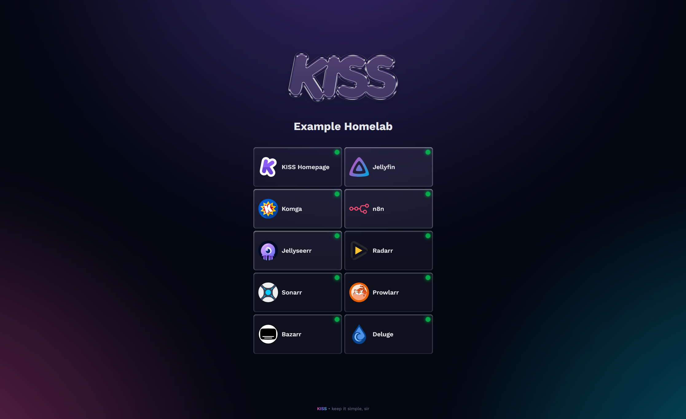

import { Card, CardGrid } from '@astrojs/starlight/components';

## About KISS

<CardGrid stagger>
	<Card title="Customizable" icon="pencil">
		Easily customize your services with a simple `config.json` file to suit your needs.
	</Card>
	<Card title="Lightweight" icon="rocket">
		KISS is designed to be fast and minimal, ensuring quick load times and a smooth user experience.
	</Card>
	<Card title="Open Source" icon="open-book">
		KISS is open source, allowing you to contribute, modify, and adapt it to your needs.
	</Card>
	<Card title="Easy Setup" icon="seti:config">
		Get started quickly with simple deployment options using Docker or Docker Compose.
	</Card>
	<Card title="Self-Hosted" icon="laptop">
		Host KISS on your own server to maintain control over your data and services.
	</Card>
</CardGrid>

## Gallery

Check out what KISS looks like in action:

